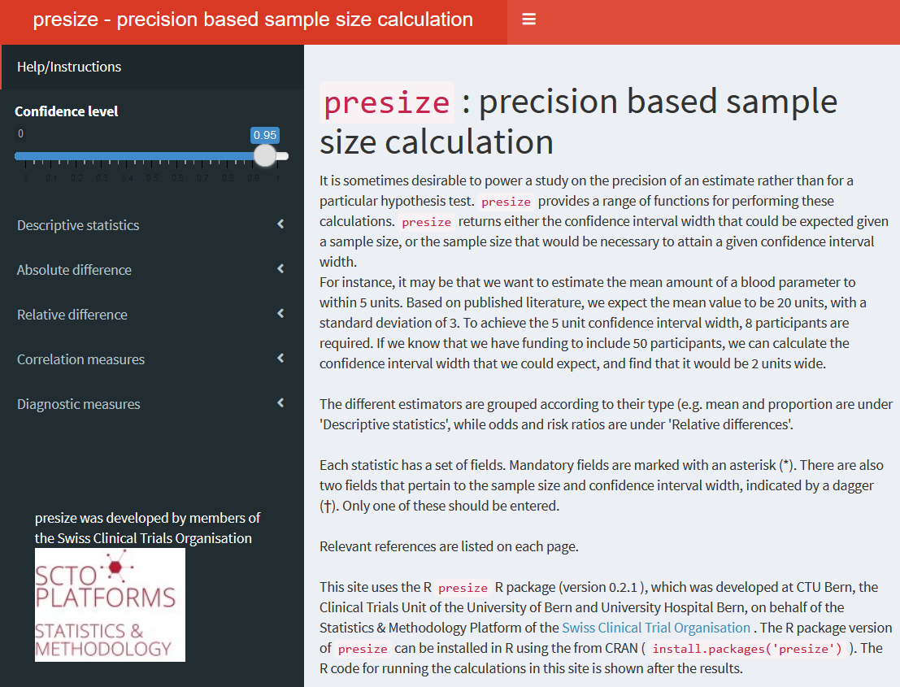

<!-- README.md is generated from README.Rmd. Please edit that file -->

# presize 

[](https://cran.r-project.org/package=presize)
[](https://github.com/CTU-Bern/presize)
[](https://shiny.ctu.unibe.ch/presize)
[](https://github.com/CTU-Bern/presize/actions)
[](https://codecov.io/gh/CTU-Bern/presize?branch=master)
[](https://doi.org/10.21105/joss.03118)
[](https://cran.r-project.org/package=presize)

[Bland (2009)](https://www.bmj.com/content/339/bmj.b3985) recommended to
base study sizes on the width of the confidence interval rather the
power of a statistical test. The goal of `presize` is to provide
functions for such precision based sample size calculations. For a given
sample size, the functions will return the precision (width of the
confidence interval), and vice versa.

## Installation

`presize` can be installed from CRAN in the usual manner:

``` r
install.packages("presize")
```

You can install the development version of `presize` with:

``` r
install.packages('presize', repos = 'https://ctu-bern.r-universe.dev')
```

## Overview

`presize` provides functions for

| Measure                               | Function         | Methods available                                                                                                        |
| ------------------------------------- | ---------------- | ------------------------------------------------------------------------------------------------------------------------ |
| **Descriptive measures**              |                  |                                                                                                                          |
| Mean                                  | `prec_mean`      |                                                                                                                          |
| Proportion                            | `prec_prop`      | Wilson, Agresti-Coull, exact, Wald (see Brown, Cai, and DasGupta 2001)                                                   |
| Rate                                  | `prec_rate`      | Score, variance stabilizing, exact, Wald (see Barker 2002)                                                               |
| **Absolute differences**              |                  |                                                                                                                          |
| Mean difference                       | `prec_meandiff`  |                                                                                                                          |
| Risk difference                       | `prec_riskdiff`  | Newcombe (Newcombe 1998), Miettinen-Nurminen (Miettinen and Nurminen 1985), Agresti-Caffo (Agresti and Caffo 2000), Wald |
| **Relative differences**              |                  |                                                                                                                          |
| Odds ratio                            | `prec_or`        | Gart, Wolff, independence smoothed logit (see Fagerland, Lydersen, and Laake 2015)                                       |
| Risk ratio                            | `prec_riskratio` | Koopman (Koopman 1984), Katz (Katz et al. 1978)                                                                          |
| Rate ratio                            | `prec_rateratio` | Rothman (Rothman and Greenland 2018)                                                                                     |
| **Correlation measures**              |                  |                                                                                                                          |
| Correlation coefficient               | `prec_cor`       | Pearson, Kendall, Spearman (see Bonnett and Wright 2000)                                                                 |
| Intraclass correlation                | `prec_icc`       | Bonnett (2002)                                                                                                           |
| Limit of agreement                    | `prec_lim_agree` | Bland and Altman (1986)                                                                                                  |
| Cohen’s kappa                         | `prec_kappa`     | Rotondi and Donner (2012)                                                                                                |
| Cronbach’s alpha                      | `prec_cronb`     | Bonett and Wright (2015)                                                                                                 |
| **Diagnostic measures**               |                  |                                                                                                                          |
| Sensitivity<sup>1</sup>               | `prec_sens`      | As per `prec_prop`                                                                                                       |
| Specificity<sup>1</sup>               | `prec_spec`      | As per `prec_prop`                                                                                                       |
| Area under the curve                  | `prec_auc`       | Hanley and McNeil (1982)                                                                                                 |
| Negative likelilood ratio<sup>2</sup> | `preg_neg_lr`    | Simel, Samsa, and Matchar (1991)                                                                                         |
| Positive likelilood ratio<sup>2</sup> | `preg_pos_lr`    | Simel, Samsa, and Matchar (1991)                                                                                         |
| Generic likelilood ratio              | `preg_lr`        | Simel, Samsa, and Matchar (1991)                                                                                         |

<sup>1</sup> Simple wrappers for `prec_prop`.

<sup>2</sup> Wrappers for `prec_lr` with values provided via sens and
spec

## Example

Suppose we want to estimate the proportion of hospital admissions with
diabetes. Diabetes has a prevalence of approximately 10% (Emerging Risk
Factors Collaboration et al. (2010)). We assume a slightly higher
proportion of diabetics, 15%, as diabetes is a risk factor for a wide
range of conditions. We want to estimate the prevalence of diabetes to
within 5% (plus/minus 2.5%). With `presize`, this is simple. We use the
`prec_prop` (precision of a proportion) function and pass our 15% and 5%
as arguments `p` and `conf.width`:

``` r
library(presize) # load the package
prec_prop(p = 0.15, conf.width = 0.05)
#> Warning in prec_prop(p = 0.15, conf.width = 0.05): more than one method was
#> chosen, 'wilson' will be used
#> 
#>      sample size for a proportion with Wilson confidence interval. 
#> 
#>      p      padj        n conf.width conf.level       lwr       upr
#> 1 0.15 0.1517077 783.4897       0.05       0.95 0.1267077 0.1767077
#> 
#> NOTE: padj is the adjusted proportion, from which the ci is calculated.
```

In the n column, we see that we would need to ask 784 (rounding 783.5
up) patients to achieve the desired CI width. Disappointingly, we also
know that we only have funds to collect the data from 600 patients. We
wonder if 600 patients would yield sufficient precision - we could also
accept a CI width of 6% (plus/minus 3%). In such a case, we can pass the
arguments `p` and `n`.

``` r
prec_prop(p = 0.15, n = 600)
#> Warning in prec_prop(p = 0.15, n = 600): more than one method was chosen,
#> 'wilson' will be used
#> 
#>      precision for a proportion with Wilson confidence interval. 
#> 
#>      p      padj   n conf.width conf.level       lwr       upr
#> 1 0.15 0.1522266 600 0.05713404       0.95 0.1236596 0.1807936
#> 
#> NOTE: padj is the adjusted proportion, from which the ci is calculated.
```

Now we see that with 600 patients, the CI would have a width of 5.7%. We
are happy with this and continue planning our study with those values.
All of the functions listed in Table 1 can be used similarly.

We can also look at a range of scenarios simulatenously by passing a
vector to one of the arguments, which could be used to create something
analogous to a power curve:

``` r
prec_prop(p = 0.15, n = seq(600, 800, 50))
#> Warning in prec_prop(p = 0.15, n = seq(600, 800, 50)): more than one method was
#> chosen, 'wilson' will be used
#> 
#>      precision for a proportion with Wilson confidence interval. 
#> 
#>      p      padj   n conf.width conf.level       lwr       upr
#> 1 0.15 0.1522266 600 0.05713404       0.95 0.1236596 0.1807936
#> 2 0.15 0.1520563 650 0.05489329       0.95 0.1246097 0.1795030
#> 3 0.15 0.1519102 700 0.05289705       0.95 0.1254617 0.1783588
#> 4 0.15 0.1517835 750 0.05110386       0.95 0.1262316 0.1773355
#> 5 0.15 0.1516726 800 0.04948148       0.95 0.1269319 0.1764133
#> 
#> NOTE: padj is the adjusted proportion, from which the ci is calculated.
```

## Shiny app

An online interactive version of the package is available
[here](https://shiny.ctu.unibe.ch/presize). The app can also be launched
locally via `launch_presize_app()` in RStudio.



## Getting help

The package website, including more details on the functions, can be
found [here](https://ctu-bern.github.io/presize/).

If you have a question, feel free to make a thread on the
[discussion](https://github.com/CTU-Bern/presize/discussions) page.

If you encounter a bug, please create an
[issue](https://github.com/CTU-Bern/presize/issues).

## Contributing

Contributions to `presize` are welcome. If you have ideas, open an
[issue](https://github.com/CTU-Bern/presize/issues) or a [discussion
thread](https://github.com/CTU-Bern/presize/discussions) on GitHub.

If you want to contribute code, please feel free to fork the repository,
make your changes and make a pull request to have them integrated into
the package. New functionality should have accompanying tests and pass
continuous integration. See also the [contributing
guidelines](https://github.com/CTU-Bern/presize/blob/master/CONTRIBUTING.md).

## Funding

`presize` was largely developed at CTU Bern, with collaboration from CTU
Basel. Funding was provided by the Swiss Clinical Trial Organisation.


<!--  -->

## Citation [](https://doi.org/10.21105/joss.03118)

If you use `presize`, please cite it in your publication as:  
Haynes et al., (2021). presize: An R-package for precision-based sample
size calculation in clinical research. Journal of Open Source Software,
6(60), 3118, <https://doi.org/10.21105/joss.03118>

### Acknowledgements

The package logo was created with
[`ggplot2`](https://ggplot2.tidyverse.org/) and
[`hexSticker`](https://github.com/GuangchuangYu/hexSticker) with icons
from [Font Awesome](https://fontawesome.com/) (via the [emojifont
package](https://github.com/GuangchuangYu/emojifont)).

## References

<div id="refs" class="references">

<div id="ref-ac2000">

Agresti, A, and B Caffo. 2000. “Simple and Effective Confidence
Intervals for Proportions and Differences of Proportions Result from
Adding Two Successes and Two Failures.” *The Americal Statistician* 54
(4): 280–88. <https://doi.org/10.2307/2685779>.

</div>

<div id="ref-barker2002">

Barker, L. 2002. “A Comparison of Nine Confidence Intervals for a
Poisson Parameter When the Expected Number of Events Is ≤ 5.” *The
Americal Statistician* 56 (2): 85–89.
<https://doi.org/10.1198/000313002317572736>.

</div>

<div id="ref-ba1986">

Bland, J M, and D G Altman. 1986. “Statistical Methods for Assessing
Agreement Between Two Methods of Clinical Measurement.” *Lancet*
i(8476): 307–10. <https://doi.org/10.1016/S0140-6736(86)90837-8>.

</div>

<div id="ref-bonet10">

Bonett, Douglas G., and Thomas A. Wright. 2015. “Cronbach’s Alpha
Reliability: Interval Estimation, Hypothesis Testing, and Sample Size
Planning.” *Journal of Organizational Behavior* 36 (1): 3–15.
<https://doi.org/https://doi.org/10.1002/job.1960>.

</div>

<div id="ref-bonnett2002">

Bonnett, D G. 2002. “Sample Size Requirements for Estimating Intraclass
Correlations with Desired Precision.” *Statistics in Medicine* 21:
1331–5. <https://doi.org/10.1002/sim.1108>.

</div>

<div id="ref-bw2000">

Bonnett, D G, and T A Wright. 2000. “Sample Size Requirements for
Estimating Pearson, Kendall and Spearman Correlations.” *Psychometrika*
65: 23–28. <https://doi.org/10.1007/BF02294183>.

</div>

<div id="ref-brown2001">

Brown, L D, T T Cai, and A DasGupta. 2001. “Interval Estimation for a
Binomial Proportion.” *Statistical Science* 16 (2): 101–17.
<https://doi.org/10.1214/ss/1009213286>.

</div>

<div id="ref-diab">

Emerging Risk Factors Collaboration, N Sarwar, P Gao, S R Seshasai, R
Gobin, S Kaptoge, E Di Angelantonio, et al. 2010. “Diabetes Mellitus,
Fasting Blood Glucose Concentration, and Risk of Vascular Disease: A
Collaborative Meta-Analysis of 102 Prospective Studies.” *Lancet* 375
(9733): 2215–22. <https://doi.org/10.1016/S0140-6736(10)60484-9>.

</div>

<div id="ref-fll2015">

Fagerland, M W, S Lydersen, and P Laake. 2015. “Recommended Confidence
Intervals for Two Independent Binomial Proportions.” *Statistical
Methods in Medical Research* 24 (2): 224–54.
<https://doi.org/10.1177/0962280211415469>.

</div>

<div id="ref-hm1982">

Hanley, J A, and B J McNeil. 1982. “The Meaning and Use of the Area
Under a Receiver Operating Characteristic (Roc) Curve.” *Radiology* 148:
29–36. <https://doi.org/10.1148/radiology.143.1.7063747>.

</div>

<div id="ref-kbap1978">

Katz, D, J Baptista, S P Azen, and M C Pike. 1978. “Obtaining Confidence
Intervals for the Risk Ratio in Cohort Studies.” *Biometrics* 34:
469–74. <https://doi.org/10.2307/2530610>.

</div>

<div id="ref-koopman1984">

Koopman, P A R. 1984. “Confidence Intervals for the Ratio of Two
Binomial Proportions.” *Biometrics* 40: 513–17.
<https://doi.org/10.2307/2531551>.

</div>

<div id="ref-mn1985">

Miettinen, O, and M Nurminen. 1985. “Comparative Analysis of Two Rates.”
*Statistics in Medicine* 4: 213–26.
<https://doi.org/10.1002/sim.4780040211>.

</div>

<div id="ref-newcombe1998">

Newcombe, R G. 1998. “Interval Estimation for the Difference Between
Independent Proportions: Comparison of Eleven Methods.” *Statistics in
Medicine* 17: 873–90.
[https://doi.org/10.1002/(sici)1097-0258(19980430)17:8\<873::aid-sim779\>3.0.co;2-i](https://doi.org/10.1002/\(sici\)1097-0258\(19980430\)17:8%3C873::aid-sim779%3E3.0.co;2-i).

</div>

<div id="ref-rg2018">

Rothman, K J, and S Greenland. 2018. “Planning Study Size Based on
Precision Rather Than Power.” *Epidemiology* 29: 599–603.
<https://doi.org/10.1097/EDE.0000000000000876>.

</div>

<div id="ref-rd2012">

Rotondi, M A, and A Donner. 2012. “A Confidence Interval Approach to
Sample Size Estimation for Interobserver Agreement Studies with Multiple
Raters and Outcomes.” *Journal of Clinical Epidemiology* 65: 778–84.
[https://doi.org/10.1016/j.jclinepi.2011.10.019](https://doi.org/10.1016/j.jclinepi.2011.10.019%20).

</div>

<div id="ref-simel1991">

Simel, D L, G P Samsa, and D B Matchar. 1991. “Likelihood Ratios with
Confidence: Sample Size Estimation for Diagnostic Test Studies.”
*Journal of Clinical Epidemiology* 44 (8): 763–70.
<https://doi.org/10.1016/0895-4356(91)90128-v>.

</div>

</div>
