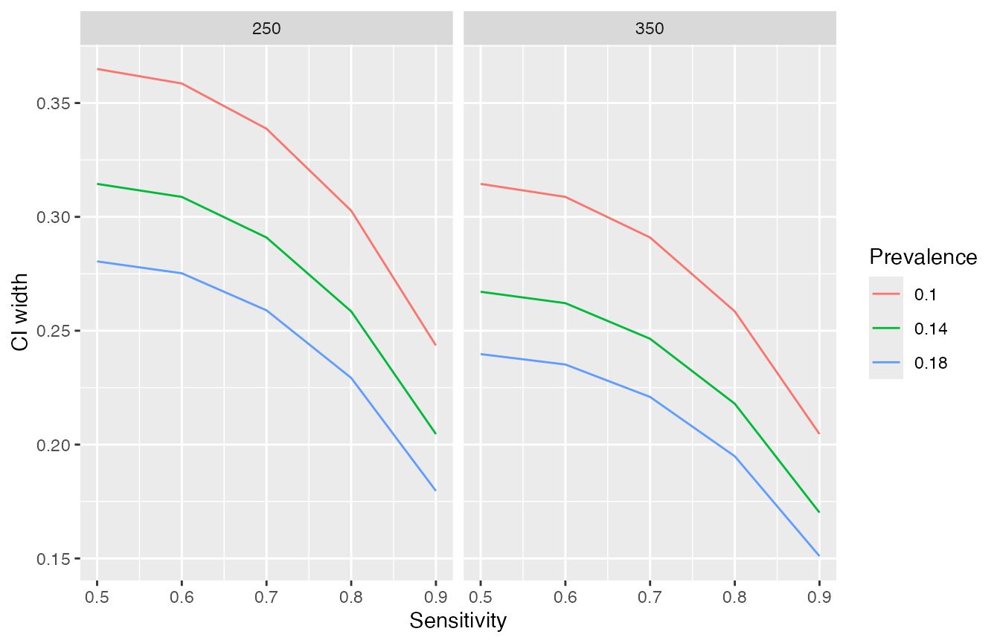

# \`presize\`

[Bland (2009)](https://www.bmj.com/content/339/bmj.b3985) recommended to
base study sizes on the width of the confidence interval rather the
power of a statistical test. The goal of `presize` is to provide
functions for such precision based sample size calculations. For a given
sample size, the functions will return the precision (width of the
confidence interval), and vice versa.

`presize` is loaded like any other R Package:

``` r
library(presize)
```

## Using `presize`

Here we present a couple of examples of using `presize` to determine the
suitable sample size for a trial.

### Precision with a fixed N

As preparation for a trial to estimate the sensitivity and specificity
of a mobile colposcope, a device for detecting tissue abnormality, a
sample size calculation was made to estimate the precision of the
sensitivity of the device. A best guess for sensitivity was 75% at a
prevalence of 15% with a desired sample size of 250 participants. As
such, the question to be answered is how wide is the confidence interval
going to be under such a scenario?

We plug the values into the `prec_sens` (precision of sensitivity)
function as follows

``` r
(ss <- prec_sens(sens   = .75,  # sensitivity 
                 prev   = .15,  # prevalence
                 ntot   = 250,  # sample size
                 method = "wilson"))
#> estimating n from 'ntot' and 'prev'
#> 
#>      precision for a sensitivity with Wilson confidence interval. 
#> 
#>   sens   sensadj  n prev ntot conf.width conf.level       lwr       upr
#> 1 0.75 0.7270475 38 0.15  250  0.2663919       0.95 0.5938516 0.8602435
#> 
#> NOTE: sensadj is the adjusted sensitivity, from which the ci is calculated.
#>       n is the number of positives, ntot the full sample
```

We see that with 250 participants, the confidence interval would be from
59% (`lwr`) to 86% (`upr`).

Note that Wilson’s method of calculating confidence intervals adjusts
the point estimate to allow the calculation of a symmetrical CI. This is
the `sensadj` variable. For some measures there are multiple methods
available. In the case of `prec_sens` (as well as `prec_spec` and
`prec_prop`), there are four different approaches for creating
confidence intervals, each yielding slightly different results.

For specificity, we use the `prec_spec` function instead. For
demonstration purposes, we can also change the method used to calculate
the CI.

``` r
prec_spec(spec   = .75,  # specificity 
          prev   = .15,  # prevalence
          ntot   = 250,  # sample size
          method = "exact")
#> estimating n from 'ntot' and 'prev'
#> 
#>      precision for a specificity with exact confidence interval. 
#> 
#>   spec specadj   n prev ntot conf.width conf.level       lwr      upr
#> 1 0.75      NA 213 0.15  250  0.1203922       0.95 0.6862538 0.806646
#> 
#> NOTE: specadj is the adjusted specificity, from which the ci is calculated.
#>       n is the number of negatives, ntot the full sample.
```

Using the other functions in `presize` is the same. For instance the
precision of a mean of 60 with an SD of 10 and 40 observations is
calculated as follows.

``` r
prec_mean(60, sd = 10, n = 40)
#> 
#>      precision for mean 
#> 
#>   mean sd  n conf.width conf.level      lwr      upr
#> 1   60 10 40    6.39631       0.95 56.80184 63.19816
```

### N for a fixed precision

While fixing the sample size is sometimes necessary, it is more common
to select a sample size based on a given precision. We might want to
achieve a sensitivity of a given amount (e.g. plus-minus 5%). This is
also possible with `presize`. Using the same code as above, we replace
the `ntot` argument with the `conf.width` argument.

``` r
(ss <- prec_sens(sens       = .75,   # sensitivity 
                 prev       = .15,   # prevalence
                 conf.width = .1,    # CI width
                 method     = "wilson"))
#> 
#>      sample size for a sensitivity with Wilson confidence interval. 
#> 
#>   sens   sensadj        n prev     ntot conf.width conf.level       lwr
#> 1 0.75 0.7466814 285.5428 0.15 1903.619        0.1       0.95 0.6966814
#>         upr
#> 1 0.7966814
#> 
#> NOTE: sensadj is the adjusted sensitivity, from which the ci is calculated.
#>       n is the number of positives, ntot the full sample
```

Under this scenario, 1904 participants (of which approximately 286 would
have the condition) will yield a CI width of 0.1 (10%), on average.

Most of the functions in `presize` have similar options, although the
sample size argument is generally `n` instead of `ntot` (`prec_sens` and
`prec_spec` are special in that you can pass either a number of
individuals with a condition to be detected with `n`, or you pass `ntot`
and `prev` to get the CI width for a mixed group in which case `n` is
derived from `ntot` and `prev`). The calculations for sensitivity can
also be preformed if the number of cases rather than the total number
and prevalence are available. For instance, if we have 50 individuals
with the condition and we expect a sensitivity of 60%, we can put those
values in instead.

``` r
prec_sens(.6, n = 50, method = "wilson")
#> 
#>      precision for a sensitivity with Wilson confidence interval. 
#> 
#>   sens   sensadj  n prev ntot conf.width conf.level       lwr       upr
#> 1  0.6 0.5928652 50   NA   NA  0.2621017       0.95 0.4618144 0.7239161
#> 
#> NOTE: sensadj is the adjusted sensitivity, from which the ci is calculated.
#>       n is the number of positives, ntot the full sample
```

Sensitivities and specificities are just proportions so `prec_prop` can
also be used for this latter example.

``` r
prec_prop(.6, n = 50, method = "wilson")
#> 
#>      precision for a proportion with Wilson confidence interval. 
#> 
#>     p      padj  n conf.width conf.level       lwr       upr
#> 1 0.6 0.5928652 50  0.2621017       0.95 0.4618144 0.7239161
#> 
#> NOTE: padj is the adjusted proportion, from which the ci is calculated.
```

Using the other functions in `presize` is the same. For instance, the
sample size to obtain a CI width of 5 units with a mean of 60 with an SD
of 10 is calculated as follows.

``` r
prec_mean(60, sd = 10, conf.width = 5)
#> 
#>      sample size for mean 
#> 
#>   mean sd       n conf.width conf.level  lwr  upr
#> 1   60 10 63.8979          5       0.95 57.5 62.5
```

### Multiple scenarios

It is common for only a vague idea of what to expect in terms of SDs,
sensitivities, etc, so it is often worthwhile creating a set of
scenarios.

Returning to the colposcope example from above… We want to see how the
CI width varies with different sensitivities. With `presize`, it’s easy
to run different scenarios, simply by passing multiple values to each
parameter (where multiple values are passed, they should have the same
length\!). For varying a single parameter, scenarios can be created with
`seq` and passed that to the appropriate `presize` functions argument.
Here we vary sensitivity between 50% and 95% in steps of 5%.

``` r
(scenario_data <- prec_sens(sens = seq(.5, .95, .05), 
                            prev = .15, 
                            ntot = 250, 
                            method = "wilson"))
#> estimating n from 'ntot' and 'prev'
#> 
#>      precision for a sensitivity with Wilson confidence interval. 
#> 
#>    sens   sensadj  n prev ntot conf.width conf.level       lwr       upr
#> 1  0.50 0.5000000 38 0.15  250  0.3030014       0.95 0.3484993 0.6515007
#> 2  0.55 0.5454095 38 0.15  250  0.3016224       0.95 0.3945983 0.6962207
#> 3  0.60 0.5908190 38 0.15  250  0.2974469       0.95 0.4420956 0.7395424
#> 4  0.65 0.6362285 38 0.15  250  0.2903543       0.95 0.4910514 0.7814056
#> 5  0.70 0.6816380 38 0.15  250  0.2801231       0.95 0.5415765 0.8216996
#> 6  0.75 0.7270475 38 0.15  250  0.2663919       0.95 0.5938516 0.8602435
#> 7  0.80 0.7724570 38 0.15  250  0.2485815       0.95 0.6481663 0.8967478
#> 8  0.85 0.8178665 38 0.15  250  0.2257283       0.95 0.7050024 0.9307307
#> 9  0.90 0.8632761 38 0.15  250  0.1960769       0.95 0.7652376 0.9613145
#> 10 0.95 0.9086856 38 0.15  250  0.1557928       0.95 0.8307891 0.9865820
#> 
#> NOTE: sensadj is the adjusted sensitivity, from which the ci is calculated.
#>       n is the number of positives, ntot the full sample
```

We can also use `expand.grid` to pass scenarios varying multiple
parameters simultaneously. Below we vary sensitivity, prevalence and
sample size.

``` r
scenarios <- expand.grid(sens = seq(.5, .95, .1),
                         prev = seq(.1, .2, .04),
                         ntot = c(250, 350))

(scenario_data <- prec_sens(sens = scenarios$sens, 
                            prev = scenarios$prev, 
                            ntot = scenarios$ntot, 
                            method = "wilson"))
#> estimating n from 'ntot' and 'prev'
#> 
#>      precision for a sensitivity with Wilson confidence interval. 
#> 
#>    sens   sensadj  n prev ntot conf.width conf.level       lwr       upr
#> 1   0.5 0.5000000 25 0.10  250  0.3649551       0.95 0.3175224 0.6824776
#> 2   0.6 0.5866808 25 0.10  250  0.3585724       0.95 0.4073946 0.7659670
#> 3   0.7 0.6733615 25 0.10  250  0.3387033       0.95 0.5040099 0.8427132
#> 4   0.8 0.7600423 25 0.10  250  0.3027037       0.95 0.6086905 0.9113942
#> 5   0.9 0.8467231 25 0.10  250  0.2435219       0.95 0.7249621 0.9684841
#> 6   0.5 0.5000000 35 0.14  250  0.3144853       0.95 0.3427574 0.6572426
#> 7   0.6 0.5901099 35 0.14  250  0.3087656       0.95 0.4357271 0.7444927
#> 8   0.7 0.6802198 35 0.14  250  0.2909327       0.95 0.5347534 0.8256862
#> 9   0.8 0.7703297 35 0.14  250  0.2584917       0.95 0.6410839 0.8995755
#> 10  0.9 0.8604396 35 0.14  250  0.2046081       0.95 0.7581356 0.9627436
#> 
#>  [Output truncated at 10 of 30 rows]
#> NOTE: sensadj is the adjusted sensitivity, from which the ci is calculated.
#>       n is the number of positives, ntot the full sample
```

From the print method, we see the details of the individual scenarios.
The default print method for `presize` objects only prints the first 10
rows, but there are in fact 30 rows (there is also a `print` function,
with an `n` option to define how many rows to print,
e.g. `print(scenario_data, n = 5)` can be used to print the first five
rows).

Using the `as.data.frame` method, we can convert the list returned by
`prec_sens` to a dataframe from which we can create tables or figures.
Where multiple scenarios are calculated, plotting them can be
particularly informative. `ggplot2`, for example, is particularly useful
for this. Below we show CI width as a function of sensitivity, but the
other parameters could be chosen instead.

``` r
scenario_df <- as.data.frame(scenario_data)

library(ggplot2)

ggplot(scenario_df, 
       aes(x = sens, 
           y = conf.width, 
           # convert colour to factor for distinct colours rather than a continuum
           col = as.factor(prev), 
           group = prev)) +
  geom_line() +
  labs(x = "Sensitivity", y = "CI width", col = "Prevalence") + 
  facet_wrap(vars(ntot))
```



We could also create a table of the scenarios containing the CIs. Below
we select only the scenarios with sensitivities above 70% and reshape
and format the table and use the `gt` package to print a nice table in
HTML.

``` r
library(dplyr)
#> 
#> Attaching package: 'dplyr'
#> The following objects are masked from 'package:stats':
#> 
#>     filter, lag
#> The following objects are masked from 'package:base':
#> 
#>     intersect, setdiff, setequal, union
library(tidyr)
library(magrittr)
#> 
#> Attaching package: 'magrittr'
#> The following object is masked from 'package:tidyr':
#> 
#>     extract
library(gt)

scenario_df %>% 
  # create the values needed specifically for the table
  mutate(
    txt = sprintf("%3.1f - %3.1f", lwr * 100, upr * 100),
    `Prevalence (%)` = prev * 100,
    Sensitivity = sens * 100,
    ntot = sprintf("N = %1.0f", ntot)) %>% 
  # select particular scenarios and variables to keep
  filter(sens > .7) %>% 
  select(ntot, Sensitivity, `Prevalence (%)`, txt) %>% 
  # reshape
  pivot_wider(
    names_from = Sensitivity, 
    values_from = txt, 
    id_cols = c(`Prevalence (%)`, ntot)) %>% 
  # group by ntot to split the table a little
  group_by(ntot) %>%
  # create the table
  gt() %>% 
  # add a header
  tab_spanner(
    label = "Sensitivity (%)",
    columns = 2:4
  ) %>% 
  cols_align("center", columns = 2:4) %>% 
  # increase the spacing between cells
  tab_style(
    style = "padding-left:12;padding-right:12;",
    locations = cells_body()
  )
```

Prevalence (%)

Sensitivity (%)

80

90

N = 250

10

60.9 - 91.1

72.5 - 96.8

14

64.1 - 90.0

75.8 - 96.3

18

66.2 - 89.1

77.9 - 95.8

N = 350

10

64.1 - 90.0

75.8 - 96.3

14

67.0 - 88.8

78.6 - 95.7

18

68.5 - 88.0

80.2 - 95.3
