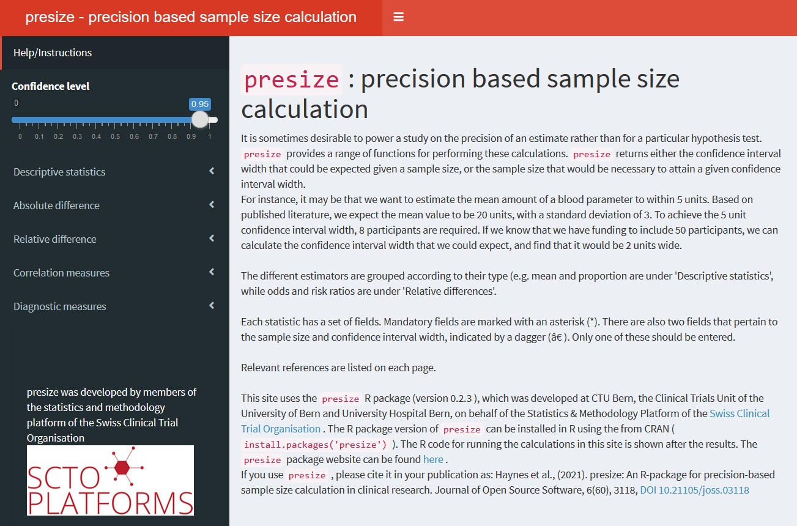

# Presize shiny app

Besides the programmatic approach to using presize, we also supply a
shiny app, enabling point-and-click interaction with the program. The
app will open in a new window. Select the appropriate method from the
menu on the left and enter the relevant parameters indicated in the
panel on the right. The output is then displayed lower down the page.

## Usage

``` r
launch_presize_app()
```

## Details

The main disadvantage to the app is that it only allows a single
scenario at a time.

The app is also available at <https://shiny.ctu.unibe.ch/presize/>.



## Examples

``` r
# launch the app
if (FALSE) { # \dontrun{
launch_presize_app()
} # }
```
